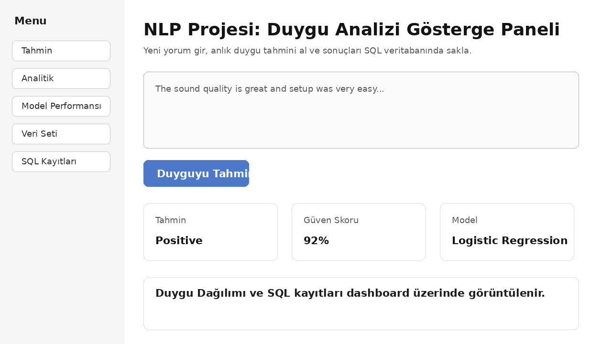
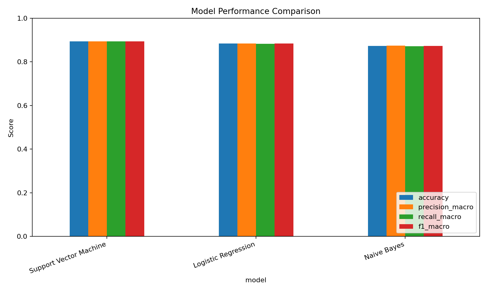
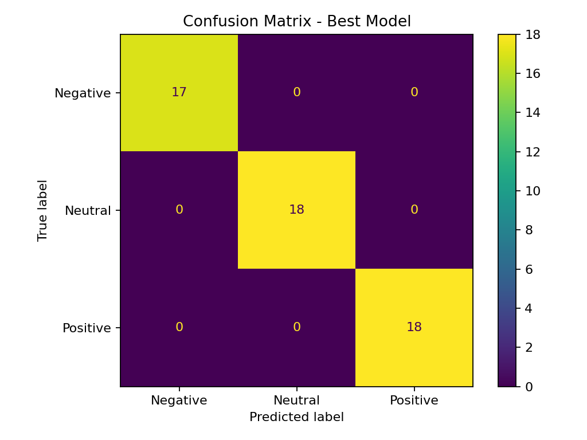
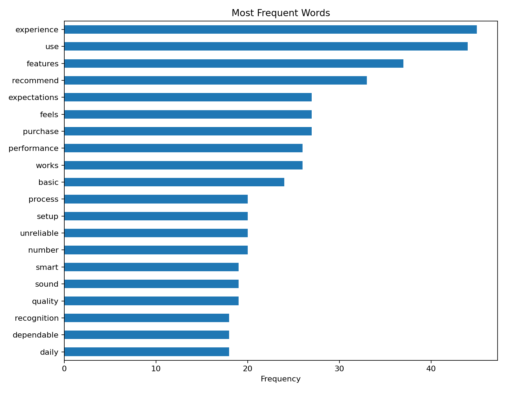

# NLP Projesi: Duygu Analizi Gösterge Paneli

Bu proje, IYD 328 İş Yeri Deneyimi kapsamında verilen **“2. Proje — NLP Projesi: Duygu Analizi Gösterge Paneli”** isterlerine göre hazırlanmıştır. Sistem, müşteri yorumlarını otomatik olarak **Positive**, **Negative** veya **Neutral** sınıflarına ayırır; tahmin sonucunu güven skoru ve zaman damgası ile SQL veritabanına kaydeder; sonuçları etkileşimli Streamlit gösterge panelinde raporlar.

## 1. Sistem Tasarımı

Proje uçtan uca bir NLP yazılım sistemi olarak tasarlanmıştır:

```text
Kaggle / Sample Dataset
        ↓
Pandas DataFrame
        ↓
Text Cleaning + Lowercase + Tokenization + Stopword Removal
        ↓
TF-IDF Feature Extraction
        ↓
Logistic Regression / Naive Bayes / SVM
        ↓
Model Evaluation + Best Model Selection
        ↓
Streamlit Dashboard
        ↓
SQL Database: reviews + predictions
```

Ana bileşenler:

- `src/data_loader.py`: Kaggle veya örnek veri setini okur.
- `src/preprocessing.py`: NLP ön işleme işlemlerini yapar.
- `src/train_models.py`: 3 farklı ML modelini eğitir ve karşılaştırır.
- `src/database.py`: SQL tablolarını oluşturur ve tahmin kayıtlarını saklar.
- `src/predict.py`: Yeni yorumlar için duygu tahmini üretir.
- `app.py`: Streamlit gösterge panelidir.

## 2. Veri Seti Açıklaması

Ödev dokümanında Kaggle üzerindeki Amazon Reviews veri seti belirtilmiştir:

- Dataset: `bittlingmayer/amazonreviews`

Kaggle veri setleri çoğu zaman oturum veya API anahtarı gerektirdiği için proje klasöründe küçük bir `sample_reviews.csv` dosyası da vardır. Bu dosya projeyi hemen çalıştırmak, dashboard'u göstermek ve eğitim akışını test etmek için eklenmiştir.

Desteklenen veri formatları:

- `data/raw/sample_reviews.csv`
- Alexa review benzeri CSV dosyaları: `review_text + sentiment` veya `verified_reviews + rating`
- Amazon Reviews fastText formatı: `train.ft.txt`, `test.ft.txt`, `.bz2`

Etiket eşleştirme:

- Rating `1-2` → `Negative`
- Rating `3` → `Neutral`
- Rating `4-5` → `Positive`
- `__label__1` → `Negative`
- `__label__2` → `Positive`

Binary Kaggle dosyalarında açık `Neutral` etiketi olmayabilir. Bu durumda model tahmin olasılığı düşükse sistem sonucu `Neutral` olarak gösterir.

## 3. NLP Ön İşleme Süreci

Proje aşağıdaki NLP adımlarını uygular:

1. Text cleaning: URL, sayı, noktalama ve özel karakter temizliği.
2. Lowercase conversion: metinlerin küçük harfe dönüştürülmesi.
3. Tokenization: yorumların kelimelere ayrılması.
4. Stopword removal: anlamsal katkısı düşük yaygın kelimelerin çıkarılması.
5. TF-IDF feature extraction: metinlerin sayısal özellik vektörlerine dönüştürülmesi.

## 4. Model Seçimi ve Gerekçesi

Projede üç model eğitilir:

1. **Logistic Regression**
   - Metin sınıflandırmada güçlü ve yorumlanabilir bir temel modeldir.
2. **Naive Bayes**
   - NLP problemlerinde hızlı, basit ve etkili bir modeldir.
3. **Support Vector Machine (SVM)**
   - Yüksek boyutlu TF-IDF vektörleriyle iyi sonuç verebilir.

En iyi model `f1_macro` skoruna göre seçilir ve `models/best_model.joblib` dosyasına kaydedilir.

## 5. Değerlendirme Ölçütleri

Her model aşağıdaki metriklerle değerlendirilir:

- Accuracy
- Precision Macro
- Recall Macro
- F1-Score Macro
- Confusion Matrix

Çıktılar:

- `models/model_metrics.csv`
- `reports/figures/model_comparison.png`
- `reports/figures/confusion_matrix.png`
- `reports/figures/word_frequency.png`

## 6. SQL Veritabanı Tasarımı

Proje varsayılan olarak SQLite kullanır. Böylece kurulum hızlıdır ve ek veritabanı servisi gerektirmez.

Tablolar:

### reviews

Hazırlanmış veri seti kayıtlarını saklar.

| Alan | Açıklama |
| --- | --- |
| id | Birincil anahtar |
| review_text | Orijinal yorum metni |
| clean_review | Temizlenmiş yorum metni |
| sentiment | Gerçek duygu etiketi |
| source | Veri kaynağı |
| loaded_at | Yüklenme zamanı |

### predictions

Kullanıcıların dashboard üzerinden gönderdiği yorum tahminlerini saklar.

| Alan | Açıklama |
| --- | --- |
| id | Birincil anahtar |
| review_text | Kullanıcının girdiği yorum |
| clean_review | Ön işlenmiş yorum |
| predicted_sentiment | Tahmin edilen duygu |
| confidence_score | Güven skoru |
| model_name | Kullanılan model |
| classified_at | Sınıflandırma zaman damgası |

Ek SQL dosyaları:

- `sql/schema_sqlite.sql`
- `sql/schema_sqlserver.sql`
- `sql/analytics_queries.sql`

## 7. Kurulum Talimatları

### 7.1. Python ile Çalıştırma

```bash
python -m venv .venv
```

Windows:

```bash
.venv\Scripts\activate
```

macOS / Linux:

```bash
source .venv/bin/activate
```

Paketleri kur:

```bash
pip install -r requirements.txt
```

Modeli eğit ve SQL veritabanını hazırla:

```bash
python scripts/run_training.py
```

Dashboard'u başlat:

```bash
streamlit run app.py
```

Tarayıcıda aç:

```text
http://localhost:8501
```

### 7.2. Kaggle Veri Seti ile Eğitim

Kaggle dosyasını `data/raw/` içine koyduktan sonra:

```bash
python scripts/run_training.py --dataset data/raw/train.ft.txt.bz2 --limit 50000
```

CSV formatı kullanıyorsan:

```bash
python scripts/run_training.py --dataset data/raw/amazon_alexa_reviews.csv
```

### 7.3. Docker ile Çalıştırma

```bash
docker compose up --build
```

Dashboard:

```text
http://localhost:8501
```

## 8. Gösterge Paneli Özellikleri

Dashboard şunları sağlar:

- Yeni yorum girme
- Anlık duygu tahmini alma
- Güven skoru görüntüleme
- Sınıf olasılıklarını görme
- Tahminleri SQL veritabanına kaydetme
- Duygu dağılımı grafikleri
- Günlük duygu eğilimleri
- Model karşılaştırma grafikleri
- Confusion Matrix görüntüleme
- En sık kullanılan kelimeleri inceleme
- `reviews` ve `predictions` SQL tablolarını görüntüleme

## 9. Gösterge Paneli Ekran Görüntüleri

Örnek arayüz görseli:



Eğitim sonrası oluşturulan grafikler:







## 10. Proje Yapısı

```text
nlp_sentiment_dashboard/
├── app.py
├── requirements.txt
├── Dockerfile
├── docker-compose.yml
├── README.md
├── GIT_COMMIT_PLAN.md
├── data/
│   ├── raw/
│   │   ├── README.md
│   │   └── sample_reviews.csv
│   └── processed/
├── docs/
│   ├── SYSTEM_DESIGN.md
│   └── screenshots/
├── models/
├── reports/
│   └── figures/
├── scripts/
│   ├── init_db.py
│   ├── prepare_dataset.py
│   └── run_training.py
├── sql/
│   ├── analytics_queries.sql
│   ├── schema_sqlite.sql
│   └── schema_sqlserver.sql
└── src/
    ├── config.py
    ├── data_loader.py
    ├── database.py
    ├── predict.py
    ├── preprocessing.py
    └── train_models.py
```

## 11. DataCamp Faz-1 İçerikleri ile İlişki

Bu proje Faz-1 kapsamındaki eğitimleri şu şekilde uygular:

| Faz-1 Eğitimi | Projedeki Karşılığı |
| --- | --- |
| Github Temelleri | Düzenli repo yapısı, `.gitignore`, anlamlı commit planı, GitHub Actions |
| Konteynerizasyon ve Sanallaştırma | `Dockerfile` ve `docker-compose.yml` |
| İstatistik Temelleri | Accuracy, Precision, Recall, F1-Score, Confusion Matrix, dağılım ve yüzde analizleri |
| Doğal Dil İşleme | Text cleaning, tokenization, stopword removal, TF-IDF, sentiment classification |
| SQL Server for Database Administrators | SQL tablo tasarımı, index kullanımı, SQL Server uyumlu şema, analitik sorgular |

## 12. GitHub'a Yükleme

```bash
git remote add origin https://github.com/<kullanici-adi>/nlp-sentiment-dashboard.git
git branch -M main
git push -u origin main
```

GitHub'a yüklemeden önce kontrol listesi:

- `README.md` güncel mi?
- `python scripts/run_training.py` sorunsuz çalışıyor mu?
- `streamlit run app.py` dashboard'u açıyor mu?
- `docker compose up --build` çalışıyor mu?
- Kaggle veri seti büyükse `.gitignore` içine takılmadan GitHub'a yüklenmiyor mu?
- Dashboard ekran görüntüleri `docs/screenshots/` içine eklendi mi?

## 13. Öğrenim Çıktıları

Bu proje ile aşağıdaki konular uygulanmıştır:

- Doğal Dil İşleme
- Metin ön işleme
- Makine öğrenmesi sınıflandırması
- Model değerlendirme
- SQL veritabanı entegrasyonu
- Veri görselleştirme
- Streamlit dashboard geliştirme
- Git ve GitHub sürüm kontrolü
- Docker ile konteynerleştirme
- Uçtan uca yapay zekâ sistemi geliştirme
