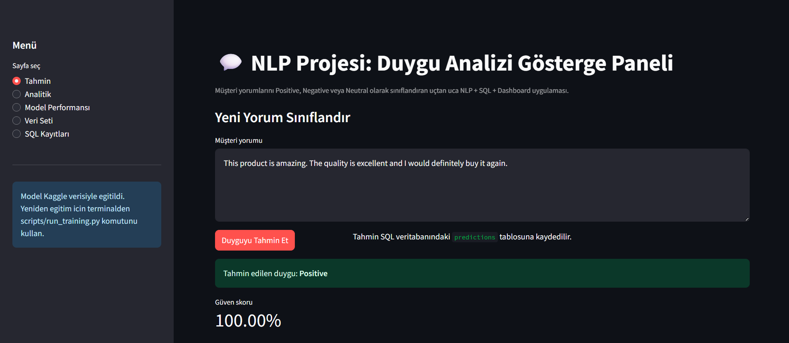
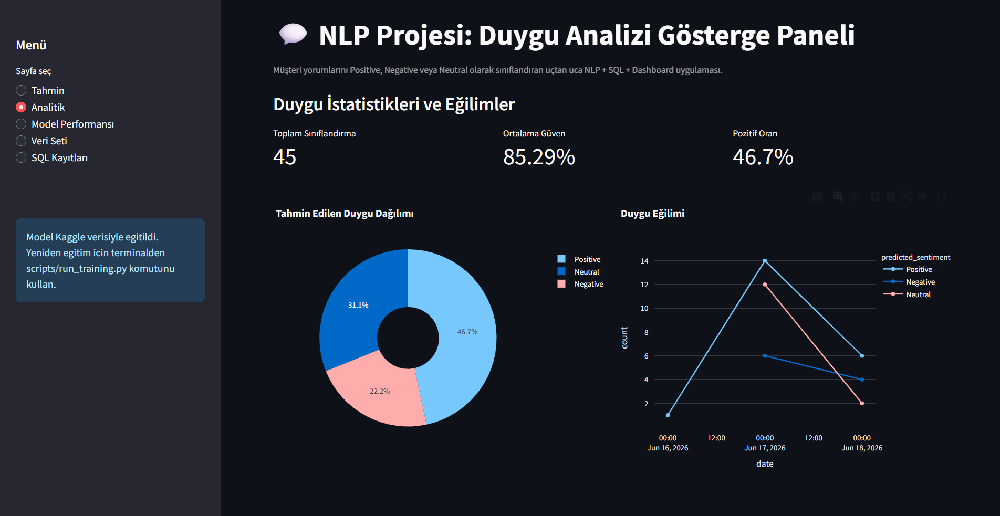
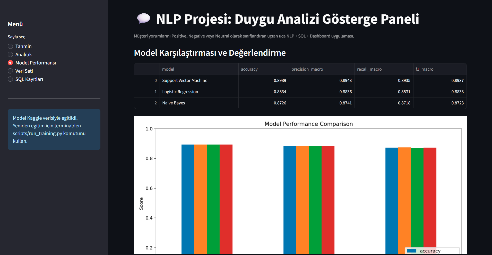
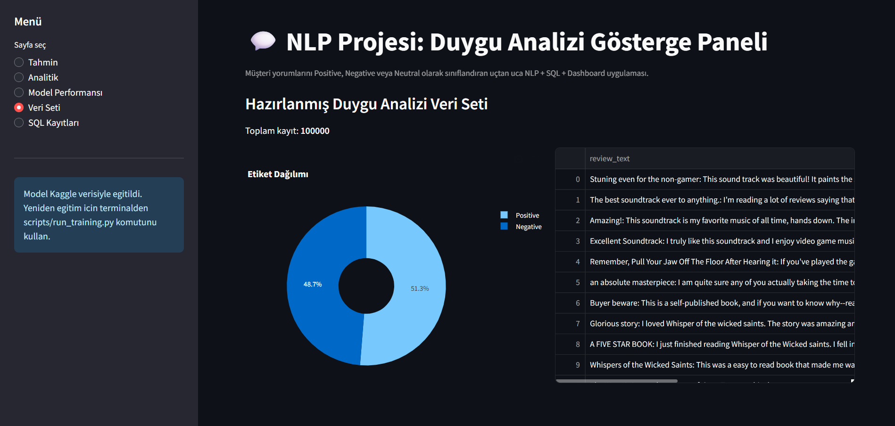
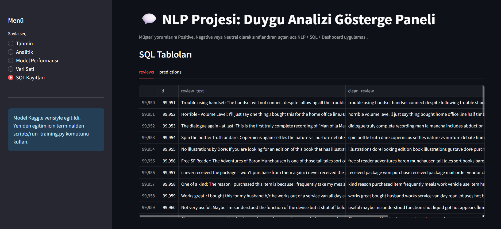

# NLP Projesi: Duygu Analizi Gösterge Paneli

Bu proje, **IYD 328 İş Yeri Deneyimi** dersi kapsamında geliştirilen uçtan uca bir **Natural Language Processing (NLP) tabanlı Duygu Analizi Gösterge Paneli** uygulamasıdır.

Projenin temel amacı, müşteri yorumlarını otomatik olarak **Positive**, **Negative** veya **Neutral** sınıflarına ayırmak, tahmin sonuçlarını güven skoru ve zaman damgası ile SQL veritabanında saklamak ve bu sonuçları etkileşimli bir dashboard üzerinden analiz edilebilir hale getirmektir.

---

## 1. Proje Amacı

Bu proje yalnızca bir makine öğrenmesi modeli oluşturmak için değil, aynı zamanda NLP, SQL veritabanı, istatistiksel değerlendirme ve veri görselleştirmeyi birleştiren bütünleşik bir yazılım sistemi geliştirmek için hazırlanmıştır.

Proje kapsamında kullanıcıların müşteri yorumlarını dashboard üzerinden girebilmesi, sistemin bu yoruma anlık duygu tahmini üretmesi ve tahmin sonucunun SQL veritabanında saklanması amaçlanmıştır.

Bu yönüyle proje aşağıdaki alanları birlikte kullanır:

* Natural Language Processing (NLP)
* Text preprocessing
* Machine learning classification
* Statistical model evaluation
* SQL database integration
* Data visualization
* Streamlit dashboard development
* Git/GitHub version control
* Docker containerization support

---

## 2. Kullanılan Veri Seti

Projede Kaggle üzerinde bulunan **Amazon Reviews** veri seti kullanılmıştır.

Kullanılan veri seti fastText formatındadır ve iki ana dosyadan oluşur:

```text
train.ft.txt.bz2
test.ft.txt.bz2
```

Veri setindeki etiketler şu şekilde yorumlanmıştır:

```text
__label__1 -> Negative
__label__2 -> Positive
```

Veri seti gerçek müşteri yorumlarından oluştuğu için duygu analizi projesi için uygundur. Ancak bu veri setinde doğrudan **Neutral** etiketi bulunmamaktadır. Bu nedenle Neutral sınıfı, modelin düşük güven skoru verdiği durumlarda kullanılacak şekilde tasarlanmıştır.

Ayrıca dashboard Türkçe arayüzle kullanıldığı için `Berbat`, `Mükemmel`, `İdare eder` gibi açık Türkçe duygu ifadeleri için küçük bir kural tabanlı destek katmanı eklenmiştir.

---

## 3. Proje Kapsamı

Proje aşağıdaki temel işlevleri destekler:

* Amazon Reviews veri setini okuma
* fastText formatındaki veriyi pandas DataFrame formatına dönüştürme
* Yorum metinlerini temizleme
* Metinleri küçük harfe dönüştürme
* Stopword kaldırma
* Tokenization işlemi
* TF-IDF ile özellik çıkarımı
* Logistic Regression, Naive Bayes ve Support Vector Machine modellerini eğitme
* Accuracy, Precision, Recall, F1-Score ve Confusion Matrix ile model değerlendirme
* En iyi modeli `joblib` formatında kaydetme
* Yeni yorumlar için anlık duygu tahmini yapma
* Tahminleri SQL veritabanına kaydetme
* Duygu dağılımlarını dashboard üzerinden görselleştirme
* Model performansını grafiklerle gösterme
* SQL kayıtlarını dashboard üzerinden görüntüleme

---

## 4. Kullanılan Teknolojiler

| Alan              | Kullanılan Teknoloji                                     |
| ----------------- | -------------------------------------------------------- |
| Programlama dili  | Python                                                   |
| Veri işleme       | pandas, numpy                                            |
| NLP               | Text cleaning, tokenization, stopword removal, TF-IDF    |
| Makine öğrenmesi  | scikit-learn                                             |
| Modeller          | Logistic Regression, Naive Bayes, Support Vector Machine |
| Görselleştirme    | matplotlib, plotly                                       |
| Dashboard         | Streamlit                                                |
| Veritabanı        | SQLite, SQLAlchemy                                       |
| Model kaydetme    | joblib                                                   |
| Sürüm kontrolü    | Git, GitHub                                              |
| Container desteği | Docker, docker-compose                                   |

---

## 5. Proje Klasör Yapısı

```text
nlp_sentiment_dashboard/
│
├── app.py
├── requirements.txt
├── README.md
├── Dockerfile
├── docker-compose.yml
│
├── src/
│   ├── config.py
│   ├── data_loader.py
│   ├── preprocessing.py
│   ├── train_models.py
│   ├── predict.py
│   └── database.py
│
├── scripts/
│   ├── run_training.py
│   ├── prepare_dataset.py
│   └── init_db.py
│
├── data/
│   ├── raw/
│   │   ├── README.md
│   │   ├── sample_reviews.csv
│   │   ├── train.ft.txt.bz2
│   │   └── test.ft.txt.bz2
│   │
│   └── processed/
│       └── processed_reviews.csv
│
├── models/
│   ├── best_model.joblib
│   └── model_metrics.csv
│
├── reports/
│   └── figures/
│       ├── confusion_matrix.png
│       ├── model_comparison.png
│       └── word_frequency.png
│
├── docs/
│   └── screenshots/
│       ├── prediction_page.png
│       ├── analytics_page.png
│       ├── model_performance_page.png
│       ├── dataset_page.png
│       └── sql_records_page.png
│
└── sql/
    ├── schema_sqlite.sql
    └── schema_sqlserver.sql
```

Not: Kaggle veri dosyaları büyük olduğu için GitHub'a yüklenmemelidir. Veri seti kullanıcı tarafından Kaggle'dan indirilip `data/raw/` klasörüne yerleştirilmelidir.

---

## 6. NLP Ön İşleme Süreci

Model eğitiminden önce yorum metinleri aşağıdaki NLP ön işleme adımlarından geçirilmiştir:

1. **Text cleaning:** URL, sayı, noktalama ve özel karakter temizliği yapılır.
2. **Lowercase conversion:** Tüm metin küçük harfe dönüştürülür.
3. **Tokenization:** Yorum metni kelimelere ayrılır.
4. **Stopword removal:** Anlamsal katkısı düşük yaygın kelimeler temizlenir.
5. **TF-IDF feature extraction:** Metinler sayısal özellik vektörlerine dönüştürülür.

Bu adımlar sonucunda ham müşteri yorumları makine öğrenmesi modellerinin kullanabileceği sayısal forma dönüştürülür.

---

## 7. Kullanılan Makine Öğrenmesi Modelleri

Projede üç farklı makine öğrenmesi modeli eğitilmiş ve karşılaştırılmıştır.

### 7.1 Logistic Regression

Logistic Regression, metin sınıflandırma problemlerinde sık kullanılan, hızlı ve yorumlanabilir bir modeldir. TF-IDF vektörleriyle birlikte duygu analizi problemlerinde güçlü bir temel model olarak kullanılabilir.

### 7.2 Naive Bayes

Naive Bayes, özellikle metin sınıflandırma ve duygu analizi problemlerinde yaygın olarak kullanılan hızlı bir algoritmadır. Basit yapısına rağmen birçok NLP probleminde etkili sonuçlar verebilir.

### 7.3 Support Vector Machine

Support Vector Machine (SVM), yüksek boyutlu TF-IDF özellik uzayında iyi performans gösterebilen güçlü bir sınıflandırma modelidir. Final eğitim sonucunda en yüksek başarıyı SVM modeli vermiştir.

---

## 8. Model Değerlendirme Metrikleri

Modeller aşağıdaki metriklerle değerlendirilmiştir:

* **Accuracy:** Toplam doğru tahmin oranı
* **Precision:** Pozitif tahminlerin ne kadarının doğru olduğunu gösterir
* **Recall:** Gerçek sınıfların ne kadarının doğru yakalandığını gösterir
* **F1-Score:** Precision ve Recall metriklerinin dengeli ortalamasıdır
* **Confusion Matrix:** Modelin sınıflar arasında yaptığı doğru ve hatalı tahminleri gösterir

Bu metrikler sayesinde modeller yalnızca doğruluk oranı ile değil, sınıflar arasındaki başarı dengesi açısından da karşılaştırılmıştır.

---

## 9. Final Eğitim Sonuçları

Final eğitim aşamasında Kaggle veri setinden alınan **100.000 yorum** kullanılmıştır. Veri seti eğitim ve test kümelerine ayrılmıştır. Test kümesinde 25.000 yorum bulunmaktadır.

### Model Performans Karşılaştırması

| Model                  | Accuracy | Precision Macro | Recall Macro | F1 Macro |
| ---------------------- | -------: | --------------: | -----------: | -------: |
| Support Vector Machine |     0.89 |            0.89 |         0.89 |     0.89 |
| Logistic Regression    |     0.88 |            0.88 |         0.88 |     0.88 |
| Naive Bayes            |     0.87 |            0.87 |         0.87 |     0.87 |

Final sonuçlara göre en iyi model:

```text
Support Vector Machine
```

Bu model `models/best_model.joblib` dosyasına kaydedilmiştir.

---

## 10. Neutral Sınıfı Yaklaşımı

Kullanılan Kaggle veri seti yalnızca iki ana sınıf içerir:

```text
Positive
Negative
```

Ancak proje isterlerinde yorumların **Positive**, **Negative** veya **Neutral** olarak sınıflandırılması beklenmektedir.

Bu nedenle sistemde Neutral sınıfı şu yaklaşımla uygulanmıştır:

* Modelin tahmin güveni yüksekse sonuç Positive veya Negative olarak gösterilir.
* Modelin tahmin güveni düşükse sonuç Neutral olarak gösterilir.
* Confidence threshold değeri 0.80 olarak ayarlanmıştır.
* Türkçe açık duygu ifadeleri için ek kural tabanlı kontrol uygulanmıştır.

Örnek sonuçlar:

| Yorum                                       | Beklenen Sonuç |
| ------------------------------------------- | -------------- |
| This product is amazing.                    | Positive       |
| The product stopped working after two days. | Negative       |
| The product is okay.                        | Neutral        |
| Berbat!                                     | Negative       |
| Mükemmel!                                   | Positive       |
| İdare eder.                                 | Neutral        |

---

## 11. SQL Veritabanı Tasarımı

Projede sınıflandırma sonuçları SQL veritabanında saklanmaktadır.

SQLite veritabanı dosyası:

```text
sentiment_dashboard.db
```

Veritabanı temel olarak iki tablo içerir:

### 11.1 reviews

Bu tablo işlenmiş yorum veri setini saklar.

Örnek alanlar:

* review_text
* clean_review
* sentiment

### 11.2 predictions

Bu tablo dashboard üzerinden yapılan yeni tahminleri saklar.

Örnek alanlar:

* review_text
* clean_review
* predicted_sentiment
* confidence_score
* model_name
* classified_at

Bu yapı sayesinde kullanıcıların girdiği yorumlar, tahmin edilen duygu değerleri ve sınıflandırma zamanları daha sonra analiz edilebilir.

---

## 12. Dashboard Özellikleri

Dashboard, Streamlit ile geliştirilmiştir.

Dashboard içinde şu sayfalar bulunur:

### 12.1 Tahmin Sayfası

Kullanıcı yeni bir müşteri yorumu girer ve sistem anlık duygu tahmini üretir.

Gösterilen bilgiler:

* Tahmin edilen duygu
* Güven skoru
* Ham model sonucu
* Sınıf olasılıkları

### 12.2 Analitik Sayfası

Duygu dağılımları ve tahmin eğilimleri görüntülenir.

### 12.3 Model Performansı Sayfası

Model karşılaştırma sonuçları, metrik tablosu ve confusion matrix gösterilir.

### 12.4 Veri Seti Sayfası

İşlenmiş veri setinden örnek kayıtlar gösterilir.

### 12.5 SQL Kayıtları Sayfası

Veritabanındaki `reviews` ve `predictions` tabloları görüntülenir.

---

## 13. Dashboard Ekran Görüntüleri

### Tahmin Sayfası



### Analitik Sayfası



### Model Performansı



### Veri Seti Sayfası



### SQL Kayıtları Sayfası



---

## 14. Kurulum

Projeyi çalıştırmak için Python 3.12 kullanılması önerilir.

### 14.1 Sanal Ortam Oluşturma

```bash
py -3.12 -m venv .venv
```

Windows PowerShell üzerinde sanal ortamı aktif etmek için:

```bash
.\.venv\Scripts\activate
```

### 14.2 Gerekli Paketleri Kurma

```bash
python -m pip install --upgrade pip
python -m pip install -r requirements.txt
```

---

## 15. Veri Setini Yerleştirme

Kaggle'dan indirilen `archive.zip` dosyası açıldıktan sonra şu dosyalar elde edilir:

```text
train.ft.txt.bz2
test.ft.txt.bz2
```

Bu dosyalar şu klasöre yerleştirilmelidir:

```text
data/raw/
```

Beklenen dosya yolları:

```text
data/raw/train.ft.txt.bz2
data/raw/test.ft.txt.bz2
```

---

## 16. Model Eğitimi

Final eğitim için kullanılan komut:

```bash
python scripts/run_training.py --dataset data/raw/train.ft.txt.bz2 --limit 100000
```

Bu komut:

* Veri setini okur
* Etiketleri dönüştürür
* Metin ön işleme yapar
* TF-IDF özellik çıkarımı uygular
* Logistic Regression, Naive Bayes ve SVM modellerini eğitir
* Modelleri karşılaştırır
* En iyi modeli kaydeder
* Metrikleri üretir
* Grafik dosyalarını oluşturur
* İşlenmiş veri setini kaydeder
* SQL veritabanını günceller

---

## 17. Dashboard Çalıştırma

Model eğitildikten sonra dashboard şu komutla başlatılır:

```bash
streamlit run app.py
```

Dashboard tarayıcıda şu adresten açılır:

```text
http://localhost:8501
```

---

## 18. Docker ile Çalıştırma

Projede Docker desteği de bulunmaktadır.

Docker ile çalıştırmak için:

```bash
docker compose up --build
```

Bu komut, uygulamayı container ortamında çalıştırmak için kullanılabilir.

---

## 19. Git ve GitHub Kullanımı

Projede Git sürüm kontrolü kullanılmalıdır.

Örnek Git komutları:

```bash
git status
git add .
git commit -m "Complete NLP sentiment dashboard project"
git push
```

GitHub'a yüklemeden önce büyük veri dosyalarının eklenmediği kontrol edilmelidir.

GitHub'a yüklenmemesi gereken dosya ve klasörler:

```text
.venv/
data/raw/train.ft.txt.bz2
data/raw/test.ft.txt.bz2
archive.zip
__pycache__/
*.db
```

---

## 20. Proje İsterleri Kontrol Listesi

| İster                                          | Durum      |
| ---------------------------------------------- | ---------- |
| Kaggle Amazon Reviews veri seti kullanımı      | Tamamlandı |
| Veri setinin pandas DataFrame olarak işlenmesi | Tamamlandı |
| SQL tablo entegrasyonu                         | Tamamlandı |
| Text cleaning                                  | Tamamlandı |
| Lowercase conversion                           | Tamamlandı |
| Stopword removal                               | Tamamlandı |
| Tokenization                                   | Tamamlandı |
| TF-IDF feature extraction                      | Tamamlandı |
| Logistic Regression modeli                     | Tamamlandı |
| Naive Bayes modeli                             | Tamamlandı |
| Support Vector Machine modeli                  | Tamamlandı |
| Accuracy metriği                               | Tamamlandı |
| Precision metriği                              | Tamamlandı |
| Recall metriği                                 | Tamamlandı |
| F1-Score metriği                               | Tamamlandı |
| Confusion Matrix                               | Tamamlandı |
| SQL'e yorum metni kaydetme                     | Tamamlandı |
| SQL'e tahmin edilen duygu kaydetme             | Tamamlandı |
| SQL'e güven skoru kaydetme                     | Tamamlandı |
| SQL'e sınıflandırma zaman damgası kaydetme     | Tamamlandı |
| Streamlit dashboard                            | Tamamlandı |
| Yeni yorum girişi                              | Tamamlandı |
| Anlık duygu tahmini                            | Tamamlandı |
| Duygu dağılımı görselleştirme                  | Tamamlandı |
| Model karşılaştırma grafikleri                 | Tamamlandı |
| Kelime frekans analizi                         | Tamamlandı |
| Dashboard ekran görüntüleri                    | Tamamlandı |
| README dosyası                                 | Tamamlandı |
| GitHub proje yapısı                            | Hazır      |

---

## 21. Sonuç

Bu proje kapsamında uçtan uca çalışan bir duygu analizi sistemi geliştirilmiştir. Sistem, Kaggle Amazon Reviews veri seti üzerinde eğitilen makine öğrenmesi modellerini kullanarak müşteri yorumlarını sınıflandırır.

Final eğitim sonucunda en iyi performansı **Support Vector Machine** modeli göstermiştir. Sistem, kullanıcıların yeni yorumlar girmesine, anlık duygu tahmini almasına, sonuçları SQL veritabanında saklamasına ve dashboard üzerinden analiz etmesine olanak sağlar.

Bu yönüyle proje; NLP, istatistiksel model değerlendirme, SQL veritabanı entegrasyonu, veri görselleştirme, dashboard geliştirme ve Git sürüm kontrolü konularını bir araya getiren bütünleşik bir yapay zekâ uygulamasıdır.
